# Subscription Management System

[](https://www.serverless.com/)
[](https://aws.amazon.com/)

Serverless solution for comprehensive subscription management with capabilities to:

- Register events via webhook
- Automate renewal notifications
- Securely store data in DynamoDB
- Send bulk emails with SES

## Table of Contents

1. [System Architecture](#system-architecture)
2. [Technical Requirements](#technical-requirements)
3. [Initial Setup](#initial-setup)
4. [AWS Deployment](#aws-deployment)
5. [API Endpoints](#api-endpoints)
6. [Data Structure](#data-structure)
7. [Workflows](#workflows)
8. [Error Handling](#error-handling)
9. [Security](#security)
10. [Monitoring](#monitoring)
11. [Contribution](#contribution)
12. [License](#license)

## System Architecture

```mermaid
flowchart TD
    subgraph "."
        D[(🗄️ DynamoDB\nSubscriptions)]
    end
    subgraph "API Gateway Flow"
        A[🍋 Lemon Squeezy\nWebhook] -->|POST /subscriptions| B[🌐 API Gateway]
        B -->|Invokes| C[λ Lambda\nhandlerSubscription]
        C -->|PutItem| D
    end

    subgraph "Scheduled Flow"
        E[⏰ EventBridge\nCron: 0 10 * * ? *] -->|Triggers| F[λ Lambda\ncheckExpirations]
        F -->|Query| D
        F -->|Send Notification| G[✉️ SES/SMS]
        end


    style A fill:#FFD700,color:black
style B fill:#9C27B0,color:white
style C fill:#00BFFF,color:white
style D fill:#FFA500,color:white
style E fill:#9C27B0,color:white
style F fill:#00BFFF,color:white
style G fill:#34A853,color:white
```



## Technical Requirements

AWS Account with permissions for:

- Lambda
- DynamoDB
- SES
- IAM
- CloudFormation

Node.js 18.x+
Serverless Framework 3.x+
Verified SES Email for sending

## Initial Setup

Clone repository

Install dependencies:

```bash
npm install
```

Configure variables in `serverless.yml`:

```yaml
custom:
  deploymentBucket: your-bucket-name
  sesEmail: notifications@yourdomain.com
  dynamoTable: Subscriptions
```

## AWS Deployment

Configure AWS credentials:

```bash
aws configure
```

Deploy full stack:

```bash
serverless deploy --stage prod --region us-east-2
```

Verify created resources:

```bash
serverless info --stage prod --region us-east-2
```

## API Endpoints

### Register Subscription Event

**POST** `https://api.yourdomain.com/prod/subscriptions`

Example Body:

```json
{
  "data": {
    "id": "sub_ABC123",
    "attributes": {
      "user_email": "client@example.com",
      "status": "active",
      "variant_name": "premium",
      "created_at": "2024-01-01T00:00:00Z",
      "renews_at": "2024-12-31T00:00:00Z"
    }
  }
}
```

Success Response:

```json
{
  "operation": "updated",
  "metadata": {
    "subscriptionId": "sub_ABC123",
    "status": "active",
    "nextBillingDate": "2024-12-31T00:00:00Z"
  }
}
```

## Data Structure

### DynamoDB Table: Subscriptions

| Attribute      | Type    | Description                      |
| -------------- | ------- | -------------------------------- |
| userId (PK)    | String  | User email address               |
| subscriptionId | String  | Unique subscription ID           |
| status         | String  | Current status (active/inactive) |
| plan           | String  | Subscription plan name           |
| startDate      | String  | Start date (ISO 8601)            |
| endDate        | String  | Expiration date (ISO 8601)       |
| cancelled      | Boolean | Cancellation status              |

Secondary Indexes:

- `status-endDate-index` (GSI)
  - Partition Key: `status`
  - Sort Key: `endDate`

## Workflows

### Notification Process

- Daily execution at 10:00 UTC via EventBridge
- DynamoDB query using GSI:
  - "active" subscriptions
  - `endDate <= (Current Date + 3 days)`
- Batch email sending via SES
- CloudWatch metrics logging

Email Template:

```html
<div style="font-family: Arial, sans-serif; max-width: 600px; margin: 0 auto;">
  <h2 style="color: #2c3e50;">Subscription Renewal</h2>
  <p>Dear user,</p>
  <p>
    Your subscription <strong>(${plan})</strong> will expire on
    <strong>${endDate}</strong>.
  </p>
  <a
    href="https://yourdomain.com/renew/${subscriptionId}"
    style="background: #3498db; color: white; padding: 10px 20px; text-decoration: none; border-radius: 5px;"
  >
    Renew Now
  </a>
  <p style="margin-top: 20px; color: #7f8c8d;">
    Questions? Contact our support team.
  </p>
</div>
```

## Error Handling

### HTTP Status Codes

| Code | Scenario                | Recommended Action     |
| ---- | ----------------------- | ---------------------- |
| 400  | Missing required fields | Verify webhook payload |
| 500  | Internal server error   | Check CloudWatch logs  |
| 200  | No update needed        | No action required     |

### Error Logging

Detailed logs are stored in CloudWatch under:

- `/aws/lambda/subscription-manager-prod-handlerSubscription`
- `/aws/lambda/subscription-manager-prod-checkExpirations`

## Security

### IAM Permissions Model

| Service    | Permissions             | Scope                    |
| ---------- | ----------------------- | ------------------------ |
| DynamoDB   | UpdateItem, Query       | Subscriptions table      |
| SES        | SendEmail, SendRawEmail | From verified email      |
| CloudWatch | PutMetricData           | Namespace: Subscriptions |

### Best Practices

- SES domain validation
- AES-256 encryption in DynamoDB
- Lambda timeout set to 15 seconds
- Lambda versioning enabled

## Monitoring

### Key Metrics

| Service  | Metric                    | Alert Threshold |
| -------- | ------------------------- | --------------- |
| Lambda   | Invocations               | > 1000/min      |
|          | Error Rate                | > 5%            |
| DynamoDB | ConsumedReadCapacityUnits | > 80% capacity  |
| SES      | Bounce Rate               | > 1%            |

### Example Dashboard

CloudWatch Dashboard: `Subscription-System-Monitor`

- Widget 1: Lambda Invocations (Last 24h)
- Widget 2: DynamoDB Read Capacity
- Widget 3: SES Delivery Metrics
- Widget 4: Error Rates by Function

## Contribution

1. Fork the repository
2. Create feature branch:

   ```bash
   git checkout -b feature/new-functionality
   ```

3. Commit changes:

   ```bash
   git commit -m "feat: add new functionality"
   ```

4. Push branch:

   ```bash
   git push origin feature/new-functionality
   ```

5. Open Pull Request

## License

Distributed under MIT License. See `LICENSE` for details.
